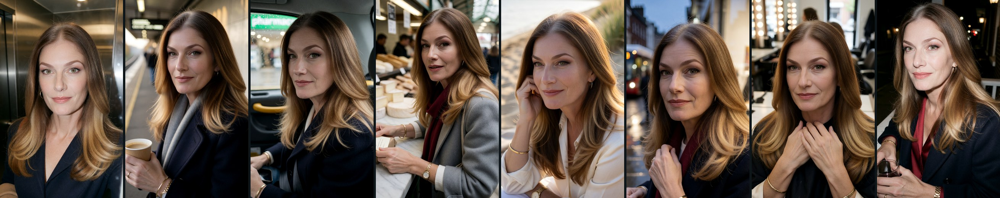
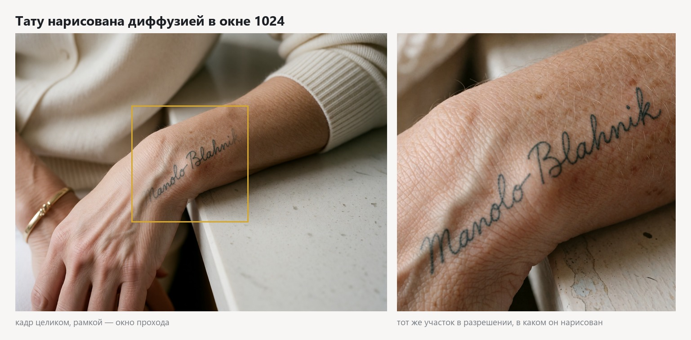
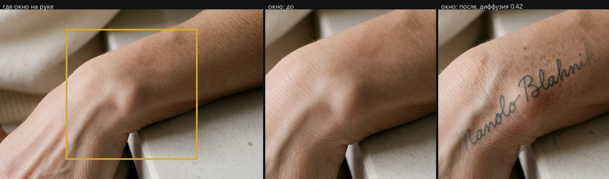

# persona-forge

**Thirty hyper-realistic photographs of one fictional woman, 51 — plus the pipeline that made them and the numbers that decide which frames ship. The face is held by a measurement, not by an eye.**

[](https://www.python.org/)
[](https://github.com/comfyanonymous/ComfyUI)
[](assets.json)
[](https://github.com/afloy011-spec/bridget-persona-forge/actions/workflows/ci.yml)
[](SKILL.md)
[](LICENSE)

[The delivery](#the-delivery) · [How this differs](#how-this-differs) · [Quick start](#quick-start) · [How it works](#how-it-works) · [The number that matters](#the-number-that-matters) · [What was tried](#the-four-decisions-the-work-rests-on) · [Knobs that do not exist](#three-knobs-that-turned-out-not-to-exist) · [Details on skin](#adding-a-detail-to-skin) · [Agent skill](#use-as-an-agent-skill) · [Rules](#the-rules-and-where-they-live)

<br>

## The delivery


| | |
|---|---|
| Part 1 — five profile pictures | [`deliverables/bridget/part1_profile/`](deliverables/bridget/part1_profile/) |
| Part 2 — the five-image story, with captions | [`deliverables/bridget/part2_story/`](deliverables/bridget/part2_story/) |
| Part 3 — the presentation | [`deliverables/bridget/presentation/index.html`](deliverables/bridget/presentation/index.html) — open it, or print to PDF |
| The wider set — twenty situations | [`deliverables/bridget/trends/`](deliverables/bridget/trends/) |
| Contact sheets | `contact_sheet.jpg` in each folder |
| The range above | twelve frames from all three deliveries, each kept at the scale it was shot rather than normalised — the face fills anywhere from 23% to 45% of the frame across the set, and flattening that was hiding the only axis along which the set genuinely varies |
| Character bible, shotlists, QA numbers | [`docs/bridget/`](docs/bridget/) |

Every photograph is also present as a separate file, which is the brief's second
delivery requirement.

<br>

## How this differs

Those are the photographs. This is the position they were made from. Each row is
a place where this pipeline decided the opposite of common practice, what the
opposite cost, and the file or the number that settles it. Rows about other
tools describe the general case and carry a source; rows about this repository
carry code — the sections below are where those numbers are worked out.

| the usual approach | here | what settles it |
|---|---|---|
| Identity is a frame measured against one reference. Adapters inject a face into each frame separately, and the published benchmark for the task compares frames to one representative frame or to 200 random pairs, then **averages** ([arXiv 2505.11425](https://arxiv.org/html/2505.11425v1)) | Identity is a property of the **set**, and the set is scored by its worst pair | [`scripts/select_set.py`](scripts/select_set.py) — `_score` returns `(worst pair, mean pair, set)` and sorts on the first; full enumeration while it fits, greedy from the best pair with swap rounds when it does not. [`scripts/gates.py`](scripts/gates.py) refuses to judge by cosine to an anchor at all: anchor and frame come from the same source, so that number stays high while the frames drift apart |
| A cosine threshold is used as an acceptance criterion, and similarity figures are usually quoted without a negative class — without saying what deliberately different people score against each other | The metric is drawn against a negative class of the project's own making, at an equal pair count. It **wins** — and it still does not become an acceptance criterion, because the floor it reports falls with the size of the set being judged | [`scripts/identity_calibration.py`](scripts/identity_calibration.py) draws sets of N random casting candidates — different women from one description — against the delivered set's worst pair, and repeats the draw inside single cells to control for scene. `assets.json → gates.required` is `chroma`, `sharp`, `skin` and nothing else: identity and cohort are reported, not enforced. Figures live in `docs/<id>/identity_calibration.json` and deliberately not in prose — four earlier prose versions went stale, the last of them saying the opposite of what the script now prints |
| Quality control is eyes on a contact sheet plus hand-picking; a check whose dependency is missing switches itself off, and the frame ships with the same verdict as a fully checked one | Three gate states, and a **not-measured required gate blocks shipping exactly like a failure** | [`scripts/metrics/verdict.py`](scripts/metrics/verdict.py) — two rules and nothing else. `NaN` and `inf` are routed to not-measured explicitly, because both comparisons against `NaN` are False and the gate used to return `PASS` with `ships=True`. A gate that does not apply to a frame gets its own `n/a` state rather than a forged `PASS` |
| Seed and prompt live in the PNG or nowhere, and selection is dragging the good files into a folder | A frame with no registry entry is rubbish and never reaches a verdict — the gates read the **ledger**, not the directory, and count unregistered neighbours aloud | [`scripts/generate.py`](scripts/generate.py) writes `frames.json` with the prompt and the actual seed; [`scripts/deliver.py`](scripts/deliver.py) keeps `selection.json`; [`scripts/adopt_canvas.py`](scripts/adopt_canvas.py) is the only door from hand work on the canvas; [`tests/test_registry.py`](tests/test_registry.py) |
| Guides describe current good practice, and advice that stopped being true simply disappears | 26 rules were **retracted by this project's own measurement** and kept as retractions, each with its `Сейчас:` and `Почему отменено:` | [`docs/RULES.md`](docs/RULES.md) — 150 rules in force, 96 of them carrying a number, 26 retracted |
| Face swap (ReActor / `inswapper`) is the standard fast route to consistency, and its texture is repaired downstream by a face restorer — the reference implementation recommends exactly that ([haofanwang/inswapper](https://github.com/haofanwang/inswapper)) | The swap **won** on the number and lost on the subject of the work, so the branch was deleted rather than left behind a flag | 14 before/after pairs: Laplacian variance inside the face mask falls **180 → 40**, and it falls on every single pair. `docs/RULES.md`, first retraction; `assets.json → identity._why_deleted`; [the four-route table](#the-four-decisions-the-work-rests-on) |
| Workflows on distilled models keep carrying a negative field, where `cfg = 1.0` makes it a literal no-op | There is no negative text field anywhere in the project — not empty, absent from the schema — and a linter keeps it that way | [`docs/environment.md`](docs/environment.md): node 5 is a `ConditioningZeroOut` fed from the same `CLIPTextEncode` as the positive. [`scripts/lint_shotlist.py`](scripts/lint_shotlist.py) fails `no` / `not` / `without` / `avoid` on a **word boundary** — the naive check flagged *notebook* and *nose* |
| Recipes for passing AI detectors forge camera EXIF; provenance standards certify history rather than truth, and are strippable ([C2PA and its limits](https://truescreen.io/articles/c2pa-standard-history-limitations/)) | EXIF is deliberately **incomplete** and the generation note deliberately **present** | [`scripts/lastmile.py`](scripts/lastmile.py) writes only what follows from the frame and the registry: focal length and aperture parsed from the camera string, ISO from the scene class, shutter from the exposure equation. Make, Model, LensModel, MakerNote, GPS, DateTimeOriginal and Software are not written at all — a batch that ran in one minute would stamp the same minute on ten frames sold as shot on different days. The disclosure goes into three fields, because different viewers show different ones |

**The swap lost on the thing being sold.** Across those 14 pairs the loss is
−78% of face texture per frame, spread −53% to −87%, and the branch left the
repository rather than hiding behind a flag: `casting.py`, `faceblend.py` and
the swap template are gone, and `--face-transfer` survives only as an explicit
key that prints a warning. The right place for a face transfer is named rather
than implied — building the LoRA's dataset, not every delivered frame.

**The mean does not know the difference.** Across the four delivered sets in
[the identity table](#the-number-that-matters) the mean barely moves — 0.763,
0.769, 0.769, 0.765 — while the worst pair falls from 0.735 on ten pairs to
0.657 on 435. A number that returns the same value for a five-frame set and a
thirty-frame cohort is not measuring the thing a reviewer catches on.

**Three states have a price, and it was paid rather than argued.** The bookshop
cell at 704×1856 put the pupils **96–97 px** apart against a 100 px floor of
measurability: all six frames came back `NOT_MEASURED` and none shipped, though
by eye they were the best in the set. That cell now runs at 832×1664, where four
of six ship — [`docs/full_figure_ratio.md`](docs/full_figure_ratio.md). The
project's own phrasing: the face was chosen over the height.

**Retractions carry numbers, not regrets.** `face_sharp_min` went 70 → 118
because blurred copies reach 109.6 and honest frames start at 126.9, so 70 sat
*outside* the gap and passed blur. The colour gate moved from saturation to hue
entropy because 37 of 45 sepia copies passed the old pair, while entropy splits
the classes clean: originals 0.407–0.721 against sepia 0.000–0.015. The default
refiner pass was reversed by its own measurement — texture 190 → 74, similarity
0.655 → 0.554. The mole trait was deleted whole, metric and gate and script and
column, although the metric worked (clean cheek 0.018, painted mark 0.249 and
0.275): the trait was on no frame and no reference, and a gate left unmeasured
eventually reads as a healthy one.

### Where this approach is weaker

* **The headline number falls as the delivery grows, and no amount of selecting
  fixes it.** `select_set.py` maximises the worst pairwise cosine, and that floor
  drops with the pair count by construction: 0.735 on ten pairs, 0.657 on 435.
  Exhaustive search over the full pool puts the reachable ceiling for thirty
  frames at 0.6966, so the only real levers are more seeds per cell — the
  measured slope is +0.0128 per doubling past eight, which extrapolates to
  1000–2000 frames instead of 281 — or a smaller delivery. A client who asks for
  more photographs gets a worse number for the same work, and that has to be said
  before it is read as decay. Adapter routes (PuLID, InstantID, IP-Adapter
  FaceID) take the face from a real reference at generation time and do not
  depend on a lucky draw, though they come with their own documented costs
  ([cubiq/ComfyUI_InstantID](https://github.com/cubiq/ComfyUI_InstantID)).

  *A correction belongs here.* This bullet used to say the metric "does not
  separate this character from strangers." It was reading a calibration file
  produced **before the character LoRA existed**, on which the verdict was
  indeed `separates: false`. Re-run against the current delivery, the answer
  reverses on every line: the delivered set beats every random draw from the
  negative class at equal pair count, and scene control separates in every cell
  it can measure. The figures are not repeated here on purpose — that is the
  rule this file keeps an erratum about, and quoting them in prose is how they
  went stale the first three times. Step 11 of [`SKILL.md`](SKILL.md) runs the
  calibration and writes the figures into `docs/<id>/`. The lesson stands even
  though the verdict flipped: a stale number in a checked-in JSON reads exactly
  like a measured one.
* **There is no path without training and without a large batch.** Text
  describes a type, not a person, so the three shipping shotlists run eight seeds
  per cell (`projects/bridget/shotlist*.json → seeds_per_cell`) and the working
  identity route needs a character LoRA trained on 50 frames of the pipeline's
  own output. The first attempt — 23 frames, rank 16, 1000 steps — was withdrawn
  as undertrained: cosine by checkpoint 250 → 0.226, 500 → 0.374, 750 → 0.420,
  1000 → 0.462, against 0.54 median from the edit route it was meant to replace.
  Competing routes need one photograph and no training at all. There is no "new
  character in an hour" here.
* **The LoRA baked what it saw, and that is measured but not fixable without
  retraining.** Hairstyle is not addressable: five states on shared seeds gave
  five identical frames, and it is not bought back by lowering strength — 1.00 →
  0.55 costs cosine 0.595 → 0.476 and the hair is down in every case
  ([`docs/variety_axes.md`](docs/variety_axes.md)). Camera distance has no verbal
  lever either; the canvas shape is the only one, and it fights measurability.
  Frontal undress does not come out of this stack at all — 0 of 8 on two
  formulations ([`docs/undress_limits.md`](docs/undress_limits.md)).
* **The measurements are honest but narrow, and the prose still drifts from the
  code.** Everything is welded to one stack: Krea 2 is its own conditioning
  interface, SD/SDXL/Flux ControlNets do not apply, exactly one control LoRA
  (depth) is public, and the dossiers declare their own narrowness — one
  character, one cell, three seeds per rung, one model. No number here transfers
  to another base model or compares to a public benchmark. Worse, the headline
  numbers are prose that nothing recomputes: the Part 2 row read 0.698 while
  `docs/undress_limits.md` carried 0.751 for the same set on the same day, and
  `docs/RULES.md` warns in its own header that it is derived and that the source
  wins. A number here becomes checkable only after `gates.py` runs.

### What this is not

Not a box that transplants. The models are declared by filename alone —
`assets.json → models.base` names `krea2_turbo_fp8_scaled.safetensors` with no
hash and no source — so "the same weights" is an assumption here, not a check.
The character LoRA is not in the repository and cannot be; without it the
pipeline falls back to selection alone, which [the identity table](#the-number-that-matters) puts at 0.474 on
the first delivery. And CI covers none of the identity work: `insightface` and
`onnxruntime` are not installed there, so identity, age and set selection have
no tests at all — not skipped ones, none — and the workflow file says so in its
own header. A green badge means the graph builders, the linter and the delivery
contract are checked. It does not mean the face is.

<br>

## Quick start

```bash
pip install -r requirements.txt
export COMFY_HOST=http://<your-comfyui>:8188   # or assets.local.json
export PERSONA_WORK_ROOT=/somewhere/outside/the/repo

# 1 · Read what will actually be sent — no GPU touched
py -3 scripts/prompts.py  projects/bridget
py -3 scripts/generate.py projects/bridget --dry

# 2 · Shoot, judge, select, ship
py -3 scripts/generate.py   projects/bridget
py -3 scripts/gates.py      projects/bridget
py -3 scripts/select_set.py projects/bridget
py -3 scripts/deliver.py    projects/bridget --auto
```

The authoritative, numbered runbook is **[`SKILL.md`](SKILL.md)** — twelve steps,
including the three that need eyes rather than a metric. The full short form is
[at the end of this file](#the-whole-runbook-short-form).

<br>

## How it works

```
character card + shotlist
   ↓  prompts.py      blocks joined in one fixed order, deduplicated
   ↓  generate.py     cell × seed, one pass, local frames + registry
   ↓  gates.py        colour, face sharpness, skin microrelief  (blocking)
   ↓                  identity, cohort, age                     (reported only)
   ↓  select_set.py   the set whose worst pair is best  ← identity happens here
   ↓  deliver.py      the chosen ones, named for a human, checked against gates
   ↓  composite_tattoo.py   the drawn asset, multiplied into the wrist
   ↓  lastmile.py     aberration, vignette, grain by scene, one JPEG encode
   ↓  qa_report.py + build_deck.py
```

A frame that is not written into the registry is treated as rubbish and never
reaches a verdict. That rule is why a frame shot by hand on the ComfyUI canvas
needs `adopt_canvas.py` to enter the pipeline at all.

<br>

## The number that matters

The **worst** pair of faces in a delivered set, measured on the shipped JPEGs
rather than on the frames they were made from. A reviewer looks at the set whole
and catches on its weakest pair; a healthy mean hides it, so the mean is not the
target and never was.

| set | what it has to hold together | frames | pairs | worst pair | mean |
|---|---|---:|---:|---:|---:|
| Part 1 — profile | five posed frames, one location each, all daylight or window light | 5 | 10 | **0.711** | 0.763 |
| Part 2 — story | one evening at home, five moments, three erotic and two nude as the brief asks | 5 | 10 | **0.735** | 0.769 |
| The twenty situations | twenty places across a whole day, and twenty different expressions | 20 | 190 | **0.687** | 0.769 |
| all thirty together | every frame that ships, measured as one cohort | 30 | 435 | **0.657** | 0.765 |
| *the first delivery, before the character LoRA existed* | *the same five scenes, the same prompts, identity by selection alone* | *5* | *10* | *0.474* | — |

Three honest notes. **The 0.72 threshold is declared for a set of five, and it does
not transfer to a larger one.** The minimum over pairs falls as the pair count
rises — ten pairs for five frames, 435 for thirty — so the same material reads
0.735 and 0.657 depending only on how many frames you put in the bag. Exhaustive
search over the whole 281-frame pool (CSP with AC-3 and MRV, binary search on the
threshold) puts the ceiling for a thirty-frame cohort at **0.6966**: 0.72 across
thirty is not reachable by any choice of the frames that exist, which makes it a
property of the pool, not a grade. `gates.py` now reads
`gates.identity_cosine_min_scope` and prints *"the threshold does not apply to a
set this size"* instead of a false FAIL. The metric itself still separates —
see the calibration below.
The source frames also score higher than what ships: finishing costs about five
hundredths of cosine, which is why the report measures what ships and not what
went in. It used to do the opposite.

And these five numbers are prose. Nothing recomputes them when the delivery
changes, so they drift: the Part 2 row read 0.698 for as long as it took to notice,
while `docs/undress_limits.md` carried 0.751 for the same set at the same time. The
authoritative figure is whatever `scripts/gates.py` prints today.

Depth of choice is the cheapest lever on that number: at three seeds per cell the
worst pair of the twenty was 0.662, at eight it was 0.696 before finishing.

<br>

## The four decisions the work rests on

**Identity is won in the weights, and everything else was tried first.** Text
describes a type, not a person: five frames written from one identical character
description produce five different women of the same type. Four ways of forcing
one face were built and measured — pairwise ArcFace cosine across frames from
different cells, against what each costs the picture:

| route | worst pair | skin | what the number cost, and what happened to the branch |
|---|---:|---|---|
| plain generation, frames taken at random | 0.40–0.60 | reference quality | the baseline: one description, five different women of the same type |
| `krea2_identity_edit` LoRA + reference image | 0.272 | reference quality | the reference drags pose and framing with it, and still loses the face |
| `Krea2EditModelPatch`, `ref_boost` 2.0 | 0.467 | reference quality | better, and still below plain generation on a good seed |
| ReActor swap + second pass + face-only blend | 0.855 | **wax** | the only rival on the number — **deleted**, it costs exactly what the brief is about |
| **character LoRA, no reference in the frame** | **0.764** | **reference quality** | **in use.** Loads first in the stack; its trigger opens every prompt |

Only the swap could match the LoRA on the number, and it destroyed exactly what
the brief is about: `inswapper` synthesises the face at 128×128 and pastes it
into a 1152×1440 frame, and everything that repairs that either irons the pores
flat or drags the face back toward the generic type. Face texture by Laplacian
variance at equal interpupillary distance, measured on 1:1 crops rather than
guessed: swap + ESRGAN **5.3**, reference photograph **60.0**, LoRA without a
swap **160.6**. The swap branch was deleted, not kept.

The LoRA is trained on the pipeline's own output — 50 frames from 50 different
scenes — and loads **first** in the stack: it answers "who is in the frame",
realism and grade answer "how it was shot". Its trigger word opens every prompt,
because a LoRA trained on a token does not activate without it, and one that
silently did not activate is indistinguishable from one that is not there.

**And the metric itself does not survive its own calibration.**
`scripts/identity_calibration.py` compares the delivered set's worst pair against
random sets of the same size drawn from casting candidates — different women
generated from the same description. A large share of those random sets score
better than ours, so ArcFace does not separate this character from a group of
strangers at all. That is the honest reason the identity gate reports rather than
blocks. The numbers live in `docs/<id>/identity_calibration.json`, never in
prose: three earlier versions of this paragraph quoted numbers and all three went
stale — see `assets.json → gates._identity_erratum`.

**Age lives in details, not in a number.** Base models pull a woman toward
twenty-seven and they do not believe the words "51-year-old". They do believe
fine lines at the outer corners of the eyes, softer skin on the neck, visible
tendons on the backs of the hands. Those are a required block in every prompt.
Removing the softening adjectives from that block bought **+4.7 years** by
detector at no cost in identity, skin or colour.

**There are no prohibitions in the prompts.** Krea 2 Turbo runs at `cfg = 1.0`,
where the negative conditioner has no effect whatsoever. Everything unwanted is
therefore expressed as a positive requirement — not "no plastic skin" but
"visible skin pores". `lint_shotlist.py` fails a shotlist that breaks this, which
it did ten times in shotlists that had already shipped.

<br>

## Three knobs that turned out not to exist

Measured, then written down rather than worked around. This is worth as much as
the ones that worked.

* **Jewellery laterality is not promptable.** The card puts the bangle and watch
  on the right wrist and keeps the left bare for the tattoo. Three formulations —
  a list of prohibitions, a positive statement, and removing the metal altogether
  — over 18 frames: the model puts a bracelet on whichever wrist is nearest the
  lens, every time. It is decided by composition, not by text. See
  `character.json → tattoo._laterality_is_not_promptable`.
* **Negations are read as requests.** At `cfg = 1.0` "no watch" contributes
  *watch*. Same root cause as the point above, and as the shower-silhouette cell
  that returned a frontal portrait in all eight seeds until it was rewritten in
  positive terms.
* **Full length is not promptable — the shape of the canvas is the only lever,
  and it is not free.** Words never produce a full figure. The declared
  full-length format, 1024×1536 (ratio 1.50), does not either: seven cells shot
  at it came back waist-up, all seven. A ladder on one cell with fixed seeds —
  1.50, 1.79, 2.00, 2.33, 2.64 — puts the whole figure with shoes in frame from
  **2.33** and holds it at 2.64.

  Two things then turned up that make this a trade rather than a fix. A cramped
  scene pulls toward portrait harder than the canvas pushes away: of seven
  re-shot cells, two gave a full figure. And the taller the canvas, the smaller
  the face — the bookshop cell at 2.64 put the pupils **96–97 px** apart, under
  the 100 px floor below which the sharpness and skin gates cannot be computed
  at all, so all six frames were `NOT_MEASURED` and none of them shipped. That
  cell now runs at 2.0: the face was chosen over the height. Measurement:
  [`docs/full_figure_ratio.md`](docs/full_figure_ratio.md).

<br>

## Use as an Agent Skill

[`SKILL.md`](SKILL.md) is the entry point for Claude Code and Cursor: the twelve
numbered steps, the three places that need eyes, what the gates can and cannot
do, and what not to do. Point the agent at it and it will run the pipeline in
order rather than inventing one.

`build_ui_edit.py` emits a ComfyUI canvas carrying the same LoRA stack and the
same cell prompt as the batch, for trying a scene by hand before paying for a
hundred frames of it. `adopt_canvas.py` pulls what was shot there back into the
registry, so hand work and batch work end up under the same verdict.

<br>

## Adding a detail to skin



*The ink is drawn by the model inside that window, on a 1024 canvas given to
the wrist alone — which is why the stroke varies in weight, follows the
surface, and has skin around it rather than under it.*



A tattoo, a mole, a scar, a piece of engraved jewellery — anything small and
graphic — is **composited, not prompted**. The ink is *multiplied* onto the
skin so it takes the light of that patch, then matched to the frame: in the
panel above the tool reported `stroke 1.9px, skin brightness 0.73, local
sharpness 23 → blur 0.7px`, so the lettering ends up exactly as soft as
everything around it.

There are two ways to do it, and the better one took a while to find. A
**graphic composite** multiplies a prepared PNG onto the skin: reproducible to
the pixel, but it never quite stops reading as ink *on* skin, because a graphic
knows nothing about the surface under it. Letting **diffusion draw the ink
inside a small window** — crop the wrist, give it its own 1024 canvas, run a
0.42 pass, stitch it back — produces ink that varies in weight along the
stroke, follows the surface and comes with pores and freckles around it. The
old objection to diffusion was that it puts the tattoo somewhere different
every time; the window removes that, because the window decides the place.

One hard-won caveat: neither method beats an out-of-focus host. The same
lettering on a wrist at local sharpness 19 stays mush; at 99 it reads. The
tool measures that and says so before you spend a pass on it.

Full recipe, the failure modes and where it refuses:
**[`docs/details.md`](docs/details.md)**.

<br>

## The rules and where they live

**[`docs/RULES.md`](docs/RULES.md)** — 150 rules in force with their grounds, 96
of them carrying a number, and 26 that were **retracted by measurement**. A
retracted rule is kept, not deleted: without it nobody can tell why the current
one looks the way it does, and in six months it gets written again.

The measurements themselves:

| dossier | question it answers |
|---|---|
| [`docs/full_figure_ratio.md`](docs/full_figure_ratio.md) | what canvas shape actually produces a full figure |
| [`docs/edit_rig_ab.md`](docs/edit_rig_ab.md) | does the realism rig cost identity in the edit branch (it does not) |
| [`docs/variety_axes.md`](docs/variety_axes.md) | which axes of variety the model listens to (expression yes, hairstyle no) |
| [`docs/undress_limits.md`](docs/undress_limits.md) | how much undress this stack gives, and why it comes from the back and from movement |
| [`docs/details.md`](docs/details.md) | how a tattoo or other detail gets onto skin, and why not by prompt |
| [`docs/looks.md`](docs/looks.md) | named looks, what each is for and what it costs |
| [`docs/environment.md`](docs/environment.md) | what has to exist on the ComfyUI side |
| [`docs/ND_WORKFLOW_REVIEW.md`](docs/ND_WORKFLOW_REVIEW.md) | review of a third-party workflow, and what was taken from it |

Russian notes and rationale live in the code comments and in the `_`-prefixed
keys of `character.json`, `shotlist*.json` and `assets.json` — that is where the
directing decisions are argued.

<br>

## The whole runbook, short form

```bash
# The authoritative, numbered runbook is SKILL.md. This is the short form.
# `projects/bridget` is the project DIRECTORY; `bridget` is the character id
# from character.json, and it is what names the folders under deliverables/,
# docs/ and $PERSONA_WORK_ROOT. The two are not interchangeable.
py -3 scripts/prompts.py     projects/bridget       # 1  read the prompts
py -3 scripts/generate.py    projects/bridget --dry # 2  plan, no GPU
py -3 scripts/generate.py    projects/bridget       # 3  the batch
py -3 scripts/build_ui_edit.py --second detail      # 3b canvas instead
py -3 scripts/adopt_canvas.py projects/bridget --cell P1 --dry
py -3 scripts/adopt_canvas.py projects/bridget --cell P1
                                                    #    canvas -> ledger
py -3 scripts/contactsheet.py $PERSONA_WORK_ROOT/bridget/frames/P1 \
    --out $PERSONA_WORK_ROOT/bridget/s.jpg --label  # 4  LOOK at it
py -3 scripts/lint_shotlist.py projects/bridget shotlist_trends.json
                                                    # 4b shotlist rules
py -3 scripts/gates.py       projects/bridget       # 5  colour/sharp/skin
py -3 scripts/gate_firing.py projects/bridget --md docs/bridget/gate_firing.md
                                                    # 5b do the gates fire?
py -3 scripts/select_set.py  projects/bridget       # 6  the best set
py -3 scripts/deliver.py     projects/bridget --auto             # 7  draft
py -3 scripts/deliver.py     projects/bridget --pick P1=… P2=…   #    ship it
py -3 scripts/contactsheet.py deliverables/bridget/part1_profile \
    --out deliverables/bridget/part1_profile/contact_sheet.jpg
                                                    # 8  LOOK: one person?
py -3 scripts/upscale.py deliverables/bridget/part1_profile \
    --out-dir $PERSONA_WORK_ROOT/bridget/big  # 8b PIXELS ON THE FACE. At
                                              #    1152x1440 the pupils are
                                              #    124 px apart and pores do
                                              #    not fit; upscaling gives
                                              #    400+. Default upscaler is
                                              #    4x_foolhardy_Remacri, chosen
                                              #    by eye at 1:1 — UltraSharp
                                              #    scored higher on Laplacian
                                              #    variance and turned hair
                                              #    into wire.
py -3 scripts/metrics/wrist.py $PERSONA_WORK_ROOT/bridget/big \
    --placements $PERSONA_WORK_ROOT/bridget/tattoo_placements.json \
    --out-dir $PERSONA_WORK_ROOT/bridget/tattooed \
    --draw $PERSONA_WORK_ROOT/bridget/wrist  # 9  where the back of the wrist
                                             #    shows; LOOK at --draw
py -3 scripts/composite_tattoo.py \
    --placements $PERSONA_WORK_ROOT/bridget/tattoo_placements.json
py -3 scripts/lastmile.py deliverables/bridget/part1_profile \
    --out <outdir>                                  # 10 LAST, not the source dir
py -3 scripts/lastmile.py $PERSONA_WORK_ROOT/bridget/tattooed \
    --out <outdir>                                  #    the tattooed ones
py -3 scripts/export_docs.py projects/bridget                    # 11 the docs
py -3 scripts/qa_report.py   projects/bridget
py -3 scripts/identity_calibration.py projects/bridget  # needs --casting first
py -3 scripts/build_deck.py  projects/bridget                    # 12
```

Other shotlists: `--shotlist shotlist_story.json` or `--shotlist
shotlist_trends.json` for steps 3, 5, 6 and 7 — a part is the name of a shotlist,
not a number out of two. Step 5b has no `--shotlist`; it only ever looks at
Part 1.

**Steps 7 → 9 → 10 are ordered.** `lastmile` writes the AI-provenance note into
EXIF, and anything run after it strips that note — including a re-run of
`deliver.py`. The tattoo composite goes before, because the last mile lays grain
and a vignette over the frame and ink pasted on top of those reads as a sticker.

**Steps 4, 8 and 9 need eyes, not a metric.** An agent that does not know a step
needs eyes will report success without having looked.

<br>

## Development

```text
persona-forge/
├── SKILL.md                    agent entry point — the numbered runbook
├── assets.json                 models, gates, formats + why each is set so
├── projects/<id>/              character card + shotlists (three characters)
├── scripts/                    36 pipeline steps, stdlib + numpy/Pillow/cv2
│   ├── prompts.py              blocks → one prompt, fixed order, deduplicated
│   ├── generate.py             cell × seed → frames + registry
│   ├── gates.py                quality verdict, three states, never two
│   ├── select_set.py           the set whose worst pair is best
│   ├── deliver.py              ship it, named for a human
│   ├── lint_shotlist.py        the measured rules, checked by letter
│   └── metrics/                12 measurements, each with its own dossier
├── templates/comfy/            14 ComfyUI graphs — 11 API, 3 hand canvases
├── docs/                       measurements, rules, environment
├── deliverables/               what actually shipped
├── tests/                      1153 tests, each written after a real break
└── LICENSE                     MIT
```

`pip install -r requirements.txt` — one file, and everything in it is really
needed: five of the eight stages import `numpy`/`Pillow`/`opencv-python`, and
`insightface` carries `select_set.py`, which is the *only* identity mechanism in
the project. Gates that cannot be computed report `NOT_MEASURED`, and a required
gate in that state **blocks shipping** rather than silently passing.

CI runs on ubuntu and windows, python 3.9 and 3.12. It needs no GPU and no model
weights, but does need `COMFY_HOST` set to any address — the tests build graphs,
they just never send them.

**Runs do not write to the worker's `output/`.** `SaveImage` is swapped for
`PreviewImage`, frames land in `temp/` and are pulled over `/view`; the local
copy is the only product. Verified on a live worker after ~250 generations. But
`temp/` does not clean itself — only a restart clears it — so clean up your own
run by modification date; the filename carries no owner.

<br>

---

**[MIT](LICENSE)** © [afloy011-spec](https://github.com/afloy011-spec)

*Every number here is reproducible from the repository. Where a measurement
retired a decision, the retired one is still written down.*
